Kiln is a PWA I built to help keep myself on task with my DSA and System Design independent study plans. I already had the plans, but no way to order the tasks and keep myself accountable aside from manual tracking and reminders which sounded annoying. I figured that as long as I was making an app, I might as well deploy it so other people can use it. 

Feel free to install it and use it for yourself on mobile or desktop through the live site, or run it locally using the info at the bottom of the README. Kiln is free to use and open source, with only the worker's responsibilities (sync, push reminders, pairing, and calendar-link syncing) relying on my live site's CRON job to function. 

If you have any questions or inquiries please reach out, and if you wanna see how it works under the hood check out the rest of the README :)

| | |
|---|---|
| **In** | AI-written plan (Markdown + one JSON block) · CSV / XLSX · one-line Quick add · LMS course calendar (.ics) |
| **Engine** | Deterministic scheduler: minutes per weekday, priority, dependencies, deadlines, pins |
| **Out** | To Do list with badge · calendar · reminders · streak heatmap |
| **Retention** | FSRS spaced reviews, opt-in per plan · daily LeetCode problem with a difficulty ramp, opt-in |
| **Data** | Lives in IndexedDB on the device. The server only ever holds ciphertext, hashes, push endpoints and reminder times |
| **Stack** | React 19 · Vite · TypeScript · Tailwind v4 · React Aria · Dexie · Zod · ts-fsrs · Cloudflare Workers + D1 |

**Contents** · [System](#system) · [Screens](#screens) · [User flows](#user-flows) · [Data flows](#data-flows) · [Data model](#data-model) · [Privacy](#privacy) · [Develop](#develop)

---

## System

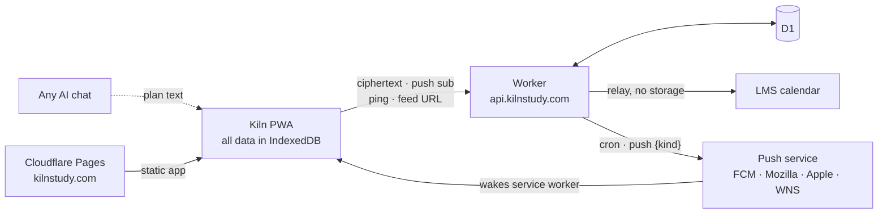
```mermaid
flowchart LR
  AI["Any AI chat"] -. "plan text" .-> APP
  PAGES["Cloudflare Pages<br/>kilnstudy.com"] -- "static app" --> APP
  APP["Kiln PWA<br/>all data in IndexedDB"] -- "ciphertext · push sub<br/>ping · feed URL" --> W
  W["Worker<br/>api.kilnstudy.com"] <--> D1[("D1")]
  W -- "relay, no storage" --> LMS["LMS calendar"]
  W -- "cron · push {kind}" --> PS["Push service<br/>FCM · Mozilla · Apple · WNS"]
  PS -- "wakes service worker" --> APP
```

### Inside the app

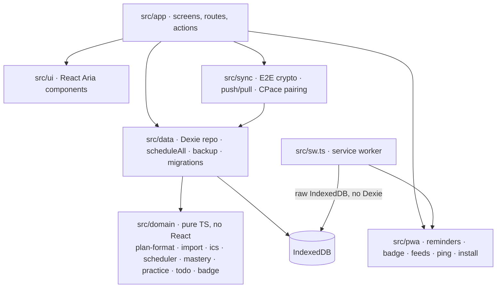
```mermaid
flowchart TB
  APP["src/app · screens, routes, actions"] --> UI["src/ui · React Aria components"]
  APP --> DATA["src/data · Dexie repo · scheduleAll · backup · migrations"]
  APP --> SYNC["src/sync · E2E crypto · push/pull · CPace pairing"] --> DATA
  APP --> PWA["src/pwa · reminders · badge · feeds · ping · install"]
  DATA --> DOM["src/domain · pure TS, no React<br/>plan-format · import · ics · scheduler · mastery · practice · todo · badge"]
  DATA --> IDB[("IndexedDB")]
  SW["src/sw.ts · service worker"] --> PWA
  SW -- "raw IndexedDB, no Dexie" --> IDB
```

### Worker

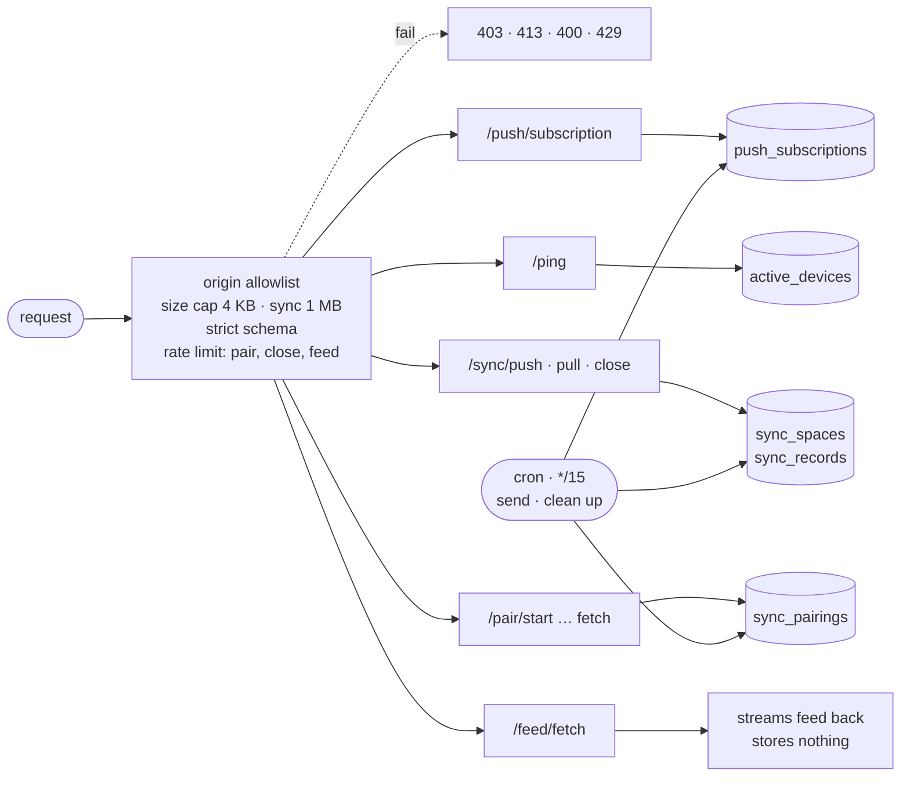
```mermaid
flowchart LR
  REQ([request]) --> G["origin allowlist<br/>size cap 4 KB · sync 1 MB<br/>strict schema<br/>rate limit: pair, close, feed"]
  G -. fail .-> ERR["403 · 413 · 400 · 429"]
  G --> P["/push/subscription"] --> T1[(push_subscriptions)]
  G --> PG["/ping"] --> T2[(active_devices)]
  G --> SY["/sync/push · pull · close"] --> T3[("sync_spaces<br/>sync_records")]
  G --> PA["/pair/start … fetch"] --> T5[(sync_pairings)]
  G --> F["/feed/fetch"] --> NS["streams feed back<br/>stores nothing"]
  C(["cron · */15<br/>send · clean up"]) --> T1 & T3 & T5
```

---

## Screens

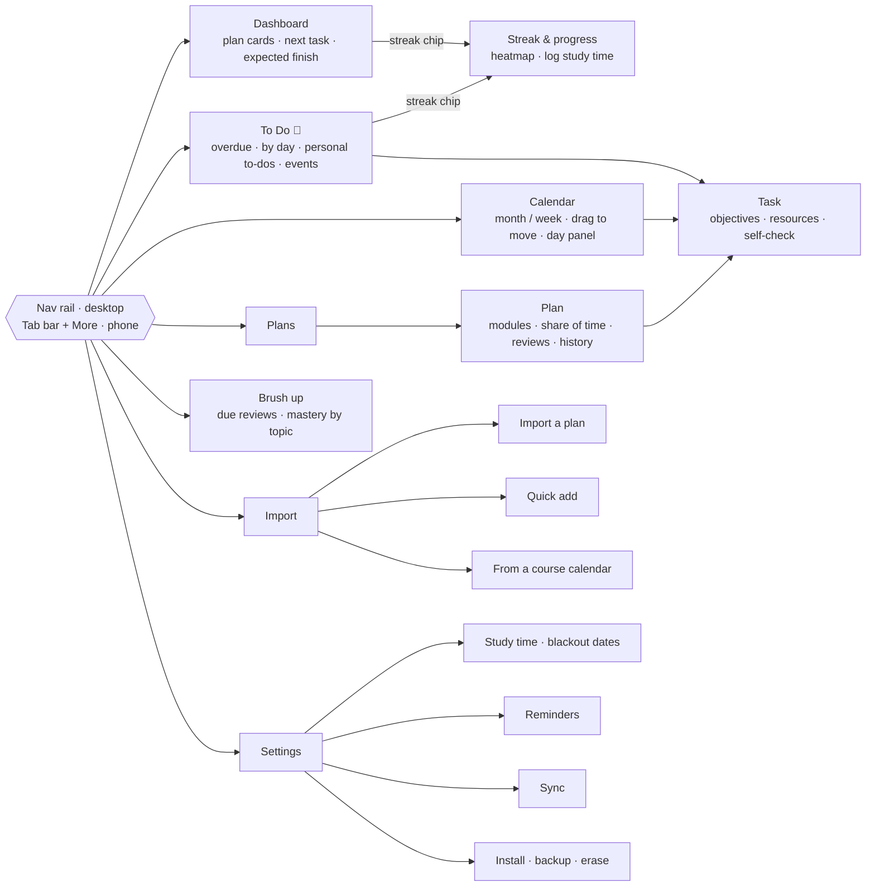
```mermaid
flowchart LR
  NAV{{"Nav rail · desktop<br/>Tab bar + More · phone"}}
  NAV --> DASH["Dashboard<br/>plan cards · next task · expected finish"]
  NAV --> TODO["To Do 🔴<br/>overdue · by day · personal to-dos · events"]
  NAV --> CAL["Calendar<br/>month / week · drag to move · day panel"]
  NAV --> PLANS["Plans"] --> PLAN["Plan<br/>modules · share of time · reviews · history"] --> TASK["Task<br/>objectives · resources · self-check"]
  NAV --> BRUSH["Brush up<br/>due reviews · mastery by topic"]
  NAV --> IMP["Import"]
  NAV --> SET["Settings"]
  IMP --> I1["Import a plan"] & I2["Quick add"] & I3["From a course calendar"]
  SET --> S1["Study time · blackout dates"] & S2["Reminders"] & S3["Sync"] & S4["Install · backup · erase"]
  DASH & TODO -- streak chip --> PROG["Streak & progress<br/>heatmap · log study time"]
  TODO --> TASK
  CAL --> TASK
```

<details><summary>Screenshots · light, dark, desktop, phone</summary>

See [`docs/design`](docs/design/README.md).

</details>

---

## User flows

### First run

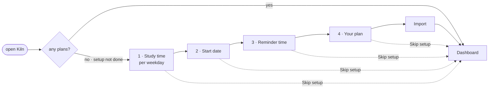
```mermaid
flowchart LR
  OPEN([open Kiln]) --> Z{any plans?}
  Z -- yes --> DASH[Dashboard]
  Z -- "no · setup not done" --> O1["1 · Study time<br/>per weekday"]
  O1 --> O2["2 · Start date"] --> O3["3 · Reminder time"] --> O4["4 · Your plan"]
  O4 --> IMP[Import] --> DASH
  O1 & O2 & O3 & O4 -. "Skip setup" .-> DASH
```

### Getting a plan in

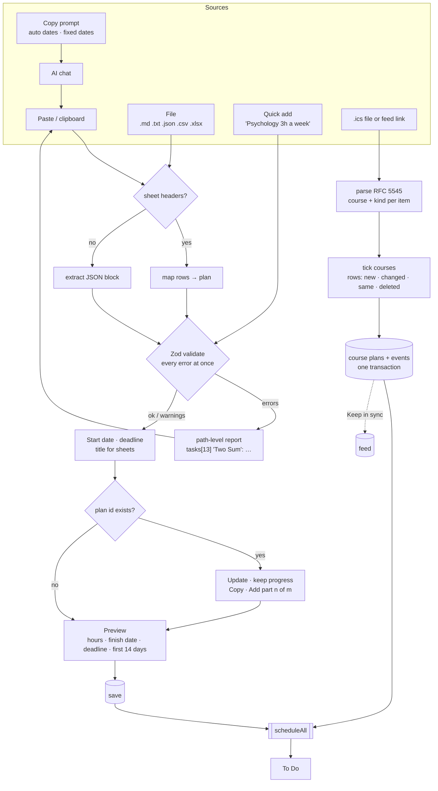
```mermaid
flowchart TB
  subgraph Sources
    PR["Copy prompt<br/>auto dates · fixed dates"] --> AI[AI chat] --> PASTE
    PASTE["Paste / clipboard"]
    FILE["File<br/>.md .txt .json .csv .xlsx"]
    QA["Quick add<br/>'Psychology 3h a week'"]
    ICS[".ics file or feed link"]
  end
  PASTE & FILE --> DET{sheet headers?}
  DET -- yes --> SHEET[map rows → plan]
  DET -- no --> BLOCK[extract JSON block]
  SHEET & BLOCK & QA --> VAL{"Zod validate<br/>every error at once"}
  VAL -- errors --> FIX["path-level report<br/>tasks[13] 'Two Sum': …"] --> PASTE
  VAL -- ok / warnings --> DET2["Start date · deadline<br/>title for sheets"]
  DET2 --> MATCH{plan id exists?}
  MATCH -- yes --> UPD["Update · keep progress<br/>Copy · Add part n of m"]
  MATCH -- no --> PREV
  UPD --> PREV["Preview<br/>hours · finish date · deadline · first 14 days"]
  PREV --> SAVE[(save)] --> SCHED[[scheduleAll]] --> TODO[To Do]

  ICS --> PARSE["parse RFC 5545<br/>course + kind per item"] --> PICK["tick courses<br/>rows: new · changed · same · deleted"]
  PICK --> CAL[("course plans + events<br/>one transaction")] --> SCHED
  CAL -. Keep in sync .-> FEED[(feed)]
```

### Daily loop

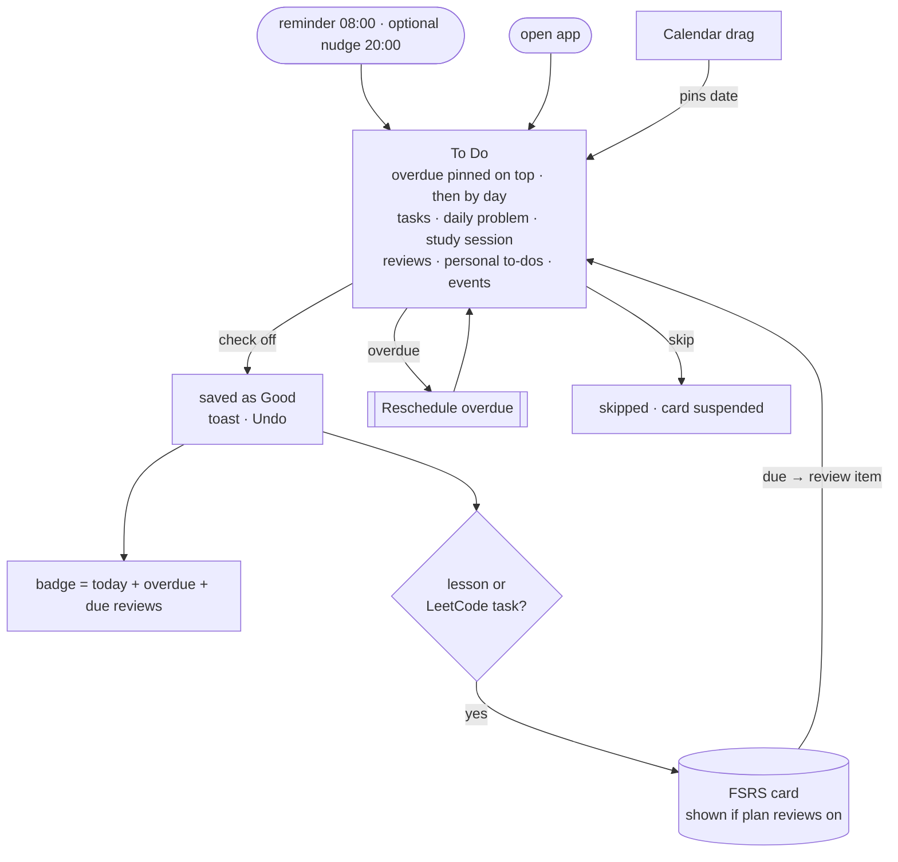
```mermaid
flowchart TB
  PUSH(["reminder 08:00 · optional nudge 20:00"]) --> TODO
  OPEN([open app]) --> TODO
  CAL["Calendar drag"] -- pins date --> TODO
  TODO["To Do<br/>overdue pinned on top · then by day<br/>tasks · daily problem · study session<br/>reviews · personal to-dos · events"]
  TODO -- check off --> DONE["saved as Good<br/>toast · Undo"]
  TODO -- overdue --> RS[[Reschedule overdue]] --> TODO
  TODO -- skip --> SK["skipped · card suspended"]
  DONE --> BADGE["badge = today + overdue + due reviews"]
  DONE --> CARD{"lesson or<br/>LeetCode task?"} -- yes --> FSRS[("FSRS card<br/>shown if plan reviews on")]
  FSRS -- "due → review item" --> TODO
```

### Edit a plan, restore a version

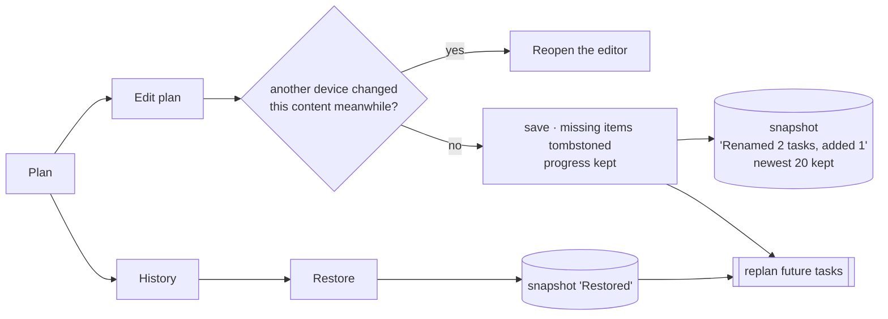
```mermaid
flowchart LR
  PLAN[Plan] --> ED[Edit plan] --> CHK{"another device changed<br/>this content meanwhile?"}
  CHK -- yes --> RE[Reopen the editor]
  CHK -- no --> SAVE["save · missing items tombstoned<br/>progress kept"] --> SNAP[("snapshot<br/>'Renamed 2 tasks, added 1'<br/>newest 20 kept")]
  SAVE --> RP[[replan future tasks]]
  PLAN --> HIS[History] --> RES[Restore] --> SNAP2[("snapshot 'Restored'")] --> RP
```

### Turn on reminders

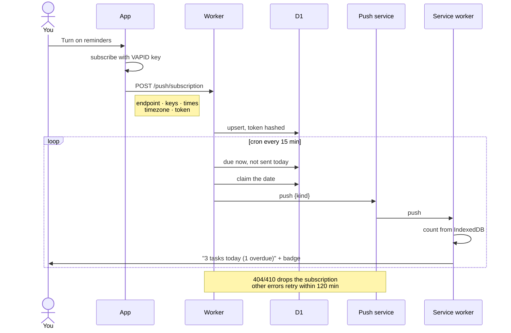
```mermaid
sequenceDiagram
  actor You
  participant App
  participant W as Worker
  participant DB as D1
  participant PS as Push service
  participant SW as Service worker
  You->>App: Turn on reminders
  App->>App: subscribe with VAPID key
  App->>W: POST /push/subscription
  Note right of App: endpoint · keys · times<br/>timezone · token
  W->>DB: upsert, token hashed
  loop cron every 15 min
    W->>DB: due now, not sent today
    W->>DB: claim the date
    W->>PS: push {kind}
    PS->>SW: push
    SW->>SW: count from IndexedDB
    SW->>You: "3 tasks today (1 overdue)" + badge
  end
  Note over W,PS: 404/410 drops the subscription<br/>other errors retry within 120 min
```

### Pair a second device

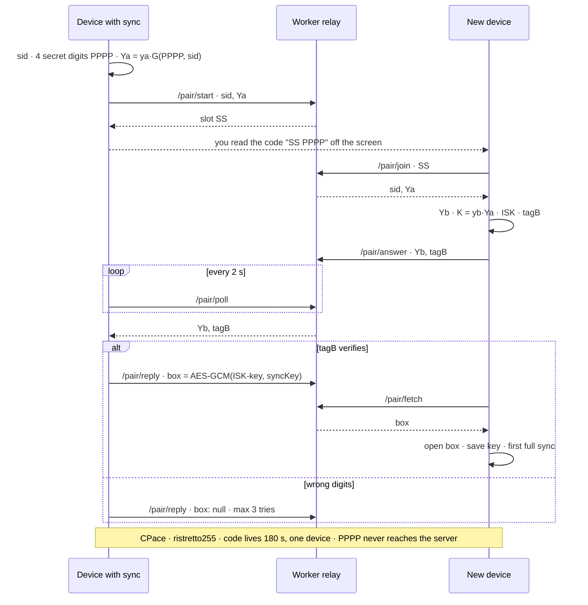
```mermaid
sequenceDiagram
  participant H as Device with sync
  participant W as Worker relay
  participant G as New device
  H->>H: sid · 4 secret digits PPPP · Ya = ya·G(PPPP, sid)
  H->>W: /pair/start · sid, Ya
  W-->>H: slot SS
  H-->>G: you read the code "SS PPPP" off the screen
  G->>W: /pair/join · SS
  W-->>G: sid, Ya
  G->>G: Yb · K = yb·Ya · ISK · tagB
  G->>W: /pair/answer · Yb, tagB
  loop every 2 s
    H->>W: /pair/poll
  end
  W-->>H: Yb, tagB
  alt tagB verifies
    H->>W: /pair/reply · box = AES-GCM(ISK-key, syncKey)
    G->>W: /pair/fetch
    W-->>G: box
    G->>G: open box · save key · first full sync
  else wrong digits
    H->>W: /pair/reply · box: null · max 3 tries
  end
  Note over H,G: CPace · ristretto255 · code lives 180 s, one device · PPPP never reaches the server
```

---

## Data flows

### Scheduler

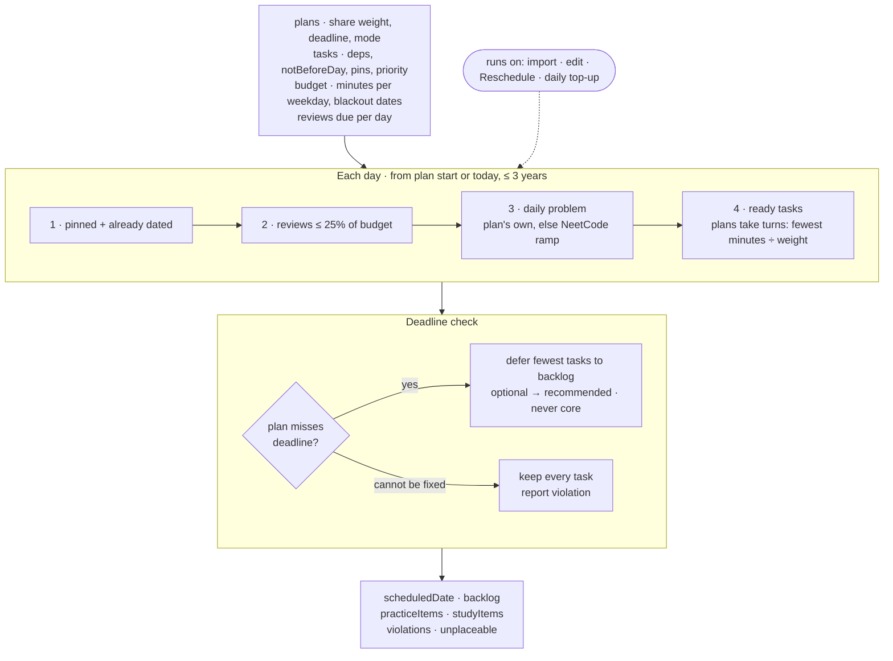
```mermaid
flowchart TB
  IN["plans · share weight, deadline, mode<br/>tasks · deps, notBeforeDay, pins, priority<br/>budget · minutes per weekday, blackout dates<br/>reviews due per day"]
  subgraph DAY["Each day · from plan start or today, ≤ 3 years"]
    direction LR
    D1["1 · pinned + already dated"] --> D2["2 · reviews ≤ 25% of budget"] --> D3["3 · daily problem<br/>plan's own, else NeetCode ramp"] --> D4["4 · ready tasks<br/>plans take turns: fewest minutes ÷ weight"]
  end
  subgraph DL[Deadline check]
    direction LR
    M{"plan misses<br/>deadline?"} -- yes --> DEF["defer fewest tasks to backlog<br/>optional → recommended · never core"]
    M -- "cannot be fixed" --> REP["keep every task<br/>report violation"]
  end
  OUT["scheduledDate · backlog<br/>practiceItems · studyItems<br/>violations · unplaceable"]
  IN --> DAY --> DL --> OUT
  TR(["runs on: import · edit · Reschedule · daily top-up"]) -.-> DAY
```

Fully deterministic: same input, same dates. Dates stay put until one of those triggers.

### Task lifecycle

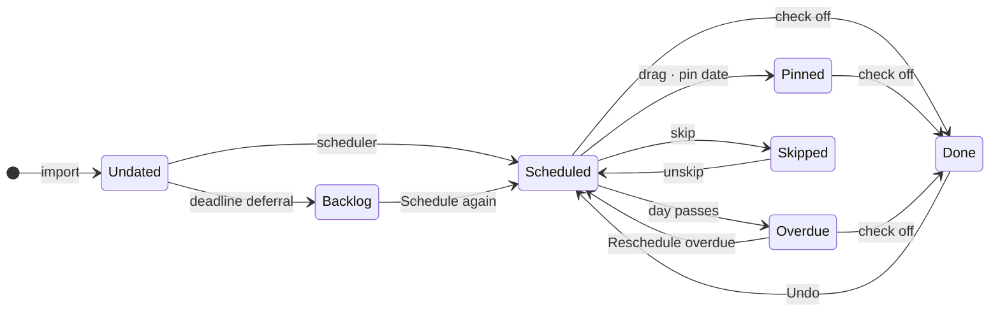
```mermaid
stateDiagram-v2
  direction LR
  [*] --> Undated: import
  Undated --> Scheduled: scheduler
  Undated --> Backlog: deadline deferral
  Backlog --> Scheduled: Schedule again
  Scheduled --> Pinned: drag · pin date
  Scheduled --> Overdue: day passes
  Overdue --> Scheduled: Reschedule overdue
  Scheduled --> Done: check off
  Pinned --> Done: check off
  Overdue --> Done: check off
  Scheduled --> Skipped: skip
  Skipped --> Scheduled: unskip
  Done --> Scheduled: Undo
```

### Daily problem ramp

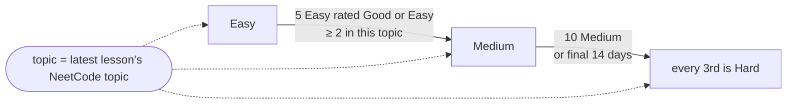
```mermaid
flowchart LR
  E["Easy"] -- "5 Easy rated Good or Easy<br/>≥ 2 in this topic" --> MED["Medium"]
  MED -- "10 Medium<br/>or final 14 days" --> H["every 3rd is Hard"]
  T(["topic = latest lesson's NeetCode topic"]) -.-> E & MED & H
```

### Sync

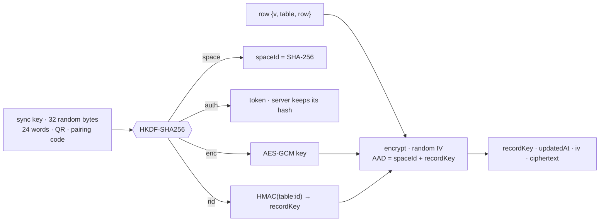
```mermaid
flowchart LR
  KEY["sync key · 32 random bytes<br/>24 words · QR · pairing code"] --> HK{{HKDF-SHA256}}
  HK -- enc --> AES[AES-GCM key]
  HK -- space --> SID["spaceId = SHA-256"]
  HK -- auth --> TOK["token · server keeps its hash"]
  HK -- rid --> RID["HMAC(table:id) → recordKey"]
  ROW["row {v, table, row}"] --> ENC["encrypt · random IV<br/>AAD = spaceId + recordKey"]
  AES & RID --> ENC
  ENC --> BLOB["recordKey · updatedAt · iv · ciphertext"]
```

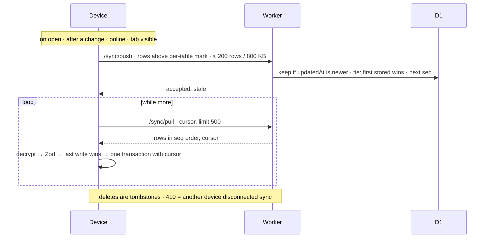
```mermaid
sequenceDiagram
  participant A as Device
  participant W as Worker
  participant DB as D1
  Note over A: on open · after a change · online · tab visible
  A->>W: /sync/push · rows above per-table mark · ≤ 200 rows / 800 KB
  W->>DB: keep if updatedAt is newer · tie: first stored wins · next seq
  W-->>A: accepted, stale
  loop while more
    A->>W: /sync/pull · cursor, limit 500
    W-->>A: rows in seq order, cursor
    A->>A: decrypt → Zod → last write wins → one transaction with cursor
  end
  Note over A,W: deletes are tombstones · 410 = another device disconnected sync
```

### Course calendar, kept in sync

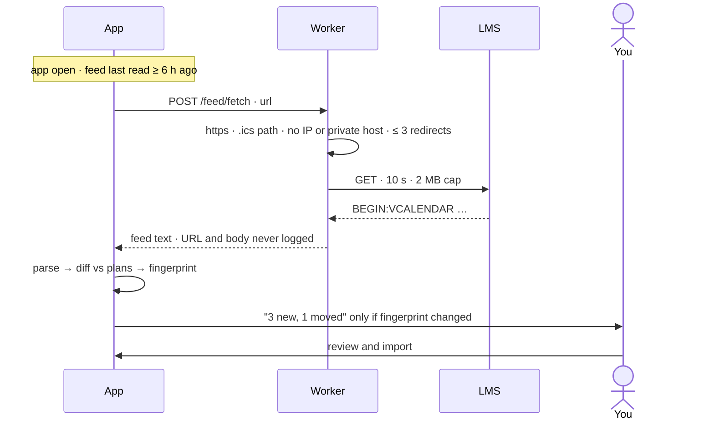
```mermaid
sequenceDiagram
  participant A as App
  participant W as Worker
  participant L as LMS
  actor You
  Note over A: app open · feed last read ≥ 6 h ago
  A->>W: POST /feed/fetch · url
  W->>W: https · .ics path · no IP or private host · ≤ 3 redirects
  W->>L: GET · 10 s · 2 MB cap
  L-->>W: BEGIN:VCALENDAR …
  W-->>A: feed text · URL and body never logged
  A->>A: parse → diff vs plans → fingerprint
  A->>You: "3 new, 1 moved" only if fingerprint changed
  You->>A: review and import
```

---

## Data model

### On the device · IndexedDB

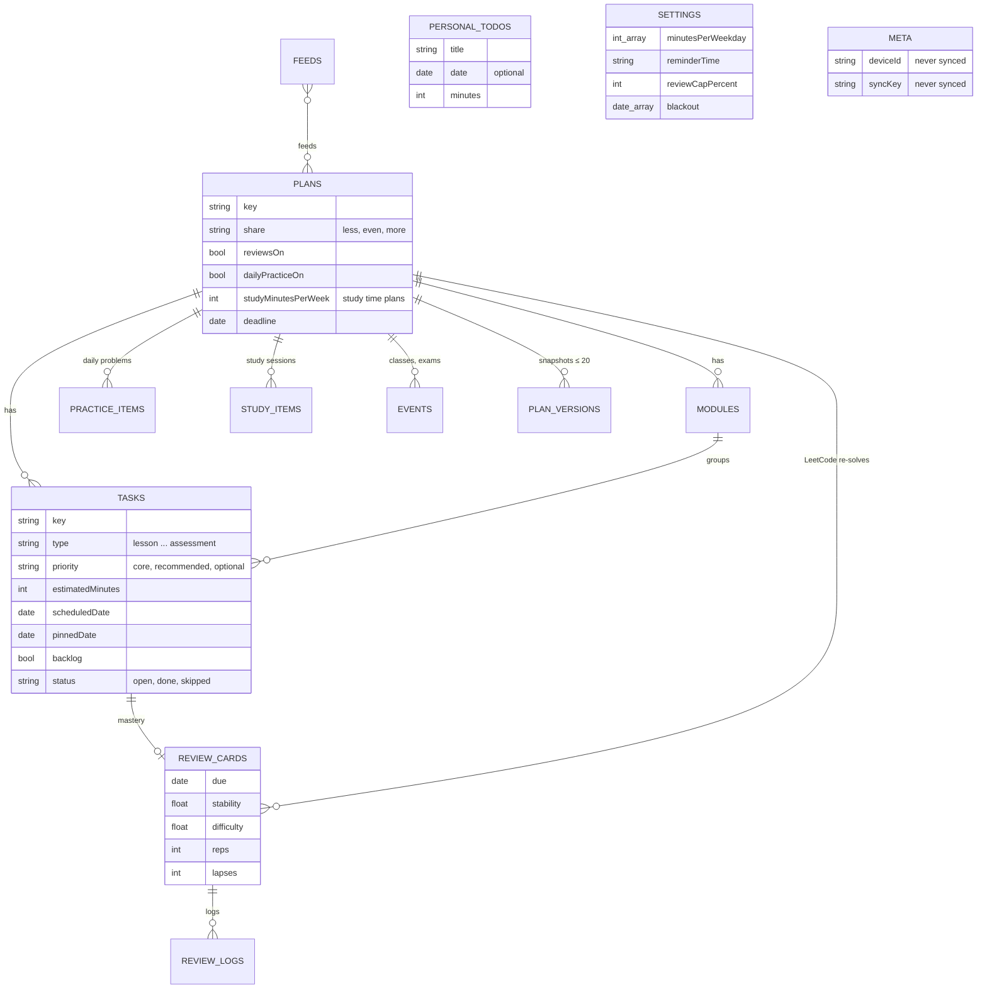
```mermaid
erDiagram
  PLANS ||--o{ MODULES : has
  PLANS ||--o{ TASKS : has
  MODULES ||--o{ TASKS : groups
  TASKS ||--o| REVIEW_CARDS : "mastery"
  PLANS ||--o{ REVIEW_CARDS : "LeetCode re-solves"
  REVIEW_CARDS ||--o{ REVIEW_LOGS : logs
  PLANS ||--o{ PRACTICE_ITEMS : "daily problems"
  PLANS ||--o{ STUDY_ITEMS : "study sessions"
  PLANS ||--o{ EVENTS : "classes, exams"
  PLANS ||--o{ PLAN_VERSIONS : "snapshots ≤ 20"
  FEEDS }o--o{ PLANS : feeds
  PLANS {
    string key
    string share "less, even, more"
    bool reviewsOn
    bool dailyPracticeOn
    int studyMinutesPerWeek "study time plans"
    date deadline
  }
  TASKS {
    string key
    string type "lesson ... assessment"
    string priority "core, recommended, optional"
    int estimatedMinutes
    date scheduledDate
    date pinnedDate
    bool backlog
    string status "open, done, skipped"
  }
  REVIEW_CARDS {
    date due
    float stability
    float difficulty
    int reps
    int lapses
  }
  PERSONAL_TODOS {
    string title
    date date "optional"
    int minutes
  }
  SETTINGS {
    int_array minutesPerWeekday
    string reminderTime
    int reviewCapPercent
    date_array blackout
  }
  META {
    string deviceId "never synced"
    string syncKey "never synced"
  }
```

Every synced row: `id` (UUIDv7) · `updatedAt` · `deleted` (tombstone) · `deviceId`. Details: [`src/data/README.md`](src/data/README.md).

### On the server · D1

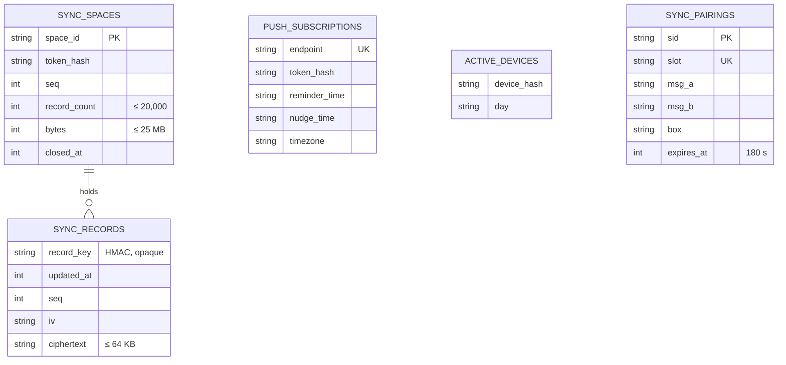
```mermaid
erDiagram
  SYNC_SPACES ||--o{ SYNC_RECORDS : holds
  SYNC_SPACES {
    string space_id PK
    string token_hash
    int seq
    int record_count "≤ 20,000"
    int bytes "≤ 25 MB"
    int closed_at
  }
  SYNC_RECORDS {
    string record_key "HMAC, opaque"
    int updated_at
    int seq
    string iv
    string ciphertext "≤ 64 KB"
  }
  PUSH_SUBSCRIPTIONS {
    string endpoint UK
    string token_hash
    string reminder_time
    string nudge_time
    string timezone
  }
  ACTIVE_DEVICES {
    string device_hash
    string day
  }
  SYNC_PAIRINGS {
    string sid PK
    string slot UK
    string msg_a
    string msg_b
    string box
    int expires_at "180 s"
  }
```

### Plan file

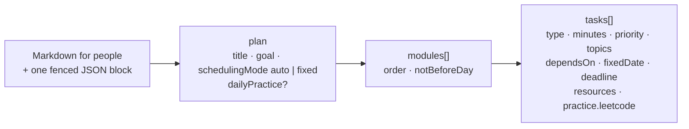
```mermaid
flowchart LR
  F["Markdown for people<br/>+ one fenced JSON block"] --> P["plan<br/>title · goal · schedulingMode auto | fixed<br/>dailyPractice?"]
  P --> M["modules[]<br/>order · notBeforeDay"] --> T["tasks[]<br/>type · minutes · priority · topics<br/>dependsOn · fixedDate · deadline<br/>resources · practice.leetcode"]
```

Spec: [`docs/plan-format.md`](docs/plan-format.md) · JSON Schema: [`docs/plan-schema.json`](docs/plan-schema.json) · prompts: [`docs/prompts`](docs/prompts) · import: [`docs/plan-import.md`](docs/plan-import.md)

---

## Privacy

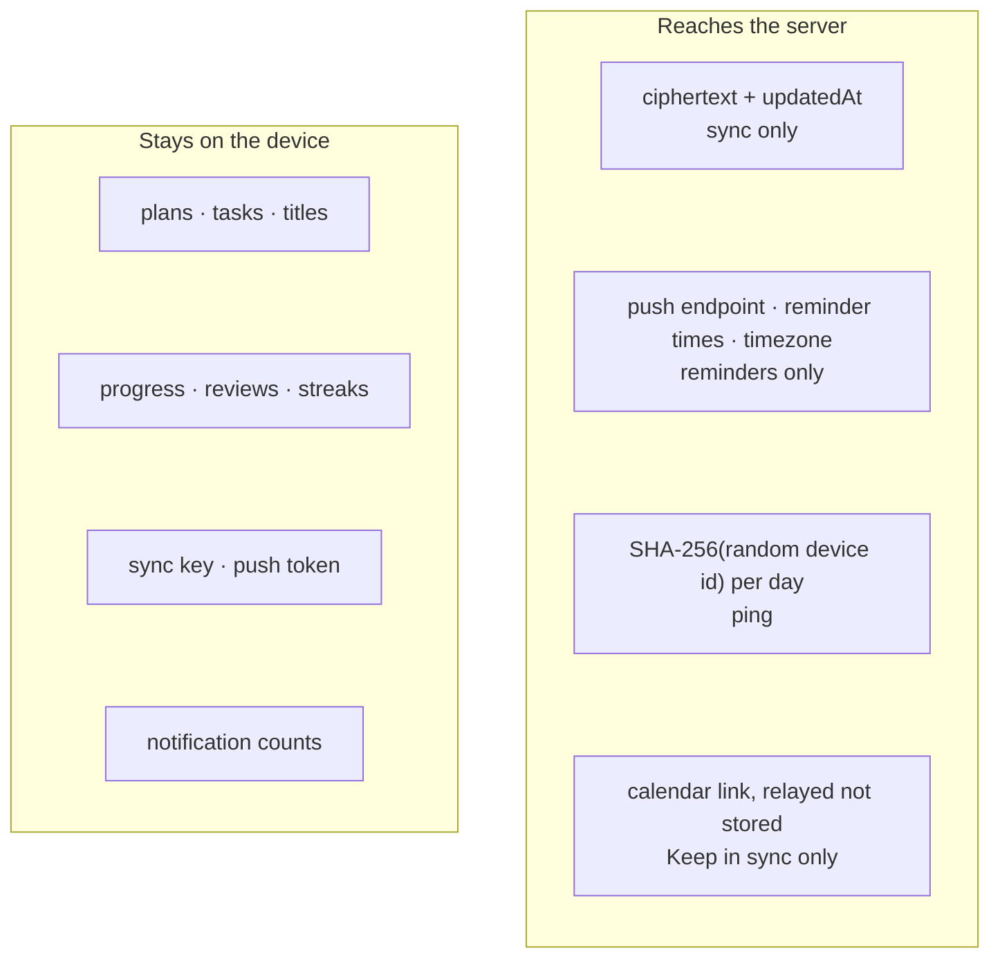
```mermaid
flowchart TB
  subgraph LEAVES["Reaches the server"]
    direction TB
    B1["ciphertext + updatedAt<br/>sync only"]
    B2["push endpoint · reminder times · timezone<br/>reminders only"]
    B3["SHA-256(random device id) per day<br/>ping"]
    B4["calendar link, relayed not stored<br/>Keep in sync only"]
  end
  subgraph STAYS["Stays on the device"]
    direction TB
    A1[plans · tasks · titles]
    A2[progress · reviews · streaks]
    A3[sync key · push token]
    A4[notification counts]
  end
  A1 ~~~ A2 ~~~ A3 ~~~ A4
  B1 ~~~ B2 ~~~ B3 ~~~ B4
```

No accounts, emails, IPs, user agents or plan content stored.

---

## Develop

```bash
npm ci && npm run dev          # Vite dev server
npm test                       # Vitest: domain, data, sync
npm run e2e                    # Playwright + axe
npm run test:worker            # Worker in the Workers runtime, in-memory D1
```

<details><summary>More scripts</summary>

| Script | Does |
|---|---|
| `lint` · `typecheck` · `build` | ESLint · `tsc -b` · production bundle |
| `schema` | JSON Schema from the Zod plan schema |
| `templates` | XLSX template from the CSV |
| `neetcode` | NeetCode problem snapshot |
| `licenses` | third-party license page |
| `icons` | PNG, maskable, Apple and `favicon.ico` from `public/kiln-arch.svg` |

</details>

```mermaid
flowchart LR
  PR([PR / push to main]) --> L[lint] --> TC[typecheck] --> U[Vitest] --> WK[Worker tests] --> E[Playwright e2e]
```

### Build settings

Baked into the public bundle at build time: use `https://`, never a secret, rebuild after changing. Local: `.env.local`.

| Variable | Meaning | When empty |
|---|---|---|
| `VITE_API_URL` | Worker address, no trailing slash. Old name `VITE_SYNC_URL` still read for one release | Reminders, sync, ping off |
| `VITE_VAPID_PUBLIC_KEY` | VAPID public key from `npm run vapid` in `worker/`; same as `worker/wrangler.toml` | Reminders off |

More stuff if you're weird like that: [`worker/README.md`](worker/README.md) · [`src/sync/README.md`](src/sync/README.md) · [`src/domain/README.md`](src/domain/README.md) · [`docs/design`](docs/design/README.md)
